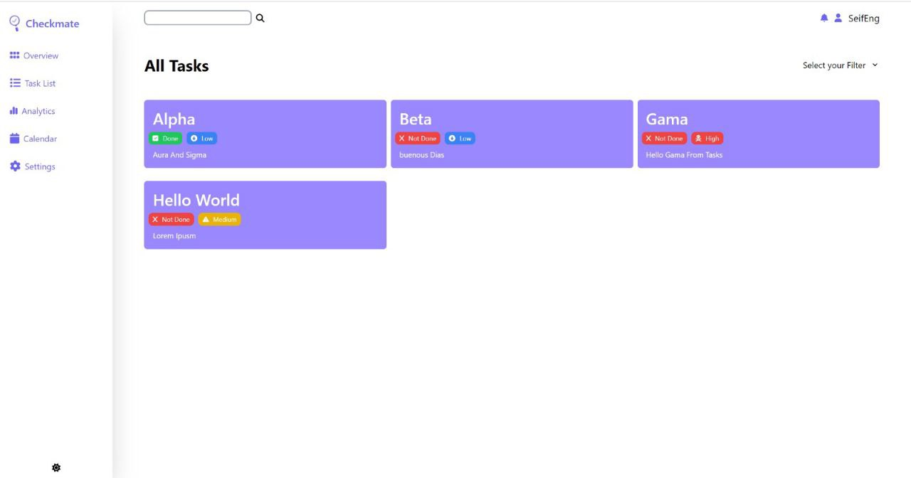
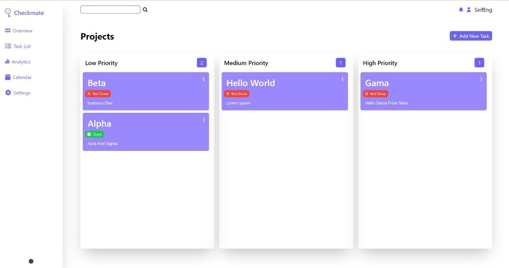
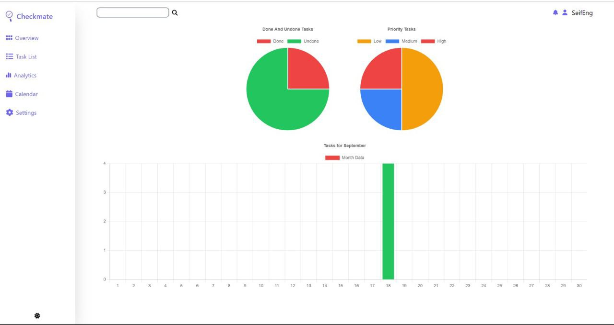

# Checkmate

## Introduction

Checkmate Task Manager is a simple yet powerful task-manager application that enables users to create, edit, delete, and manage their tasks efficiently. 

This project was developed as a collaborative effort between [Ahmed Henawy] and [Seif Mohamed].

- **Final Project Blog Article**: [Read the blog here](https://medium.com/@eng.seifmohamed2004/first-milestone-in-software-engineering-journey-7e5a1b0a0b7c)
- **Authors**:
  - [Seif Mohamed](https://www.linkedin.com/in/seif-mohamed-bb7b33252/)
  - [Ahmed Henawy](https://www.linkedin.com/in/ahmedhenawy/)

## Usage

Checkmate Task Manager is designed to help you efficiently manage and prioritize your tasks. Here’s how to use the key features:

1. **Sign Up**: Create an account by providing your username, email, and password.
   

2. **Log In**: Once registered, log in with your email and password to access your task manager.
   

3. **Dashboard**: After logging in, you’ll be taken to the main dashboard where you can manage all your tasks in one place.
   - **Task Management**: Add, edit, or delete tasks easily.
     
   - **Task Priority**: View tasks separated by priority levels (e.g., high, medium, low) for better organization.
     

4. **Analytical Dashboard**: Track your task progress and get an overview of your productivity with visual analytics that show completed tasks, pending tasks, and more.
   

5. **Create and View Tasks**: Add new tasks with descriptions and track them in real-time on the dashboard.

6. **Edit and Delete Tasks**: If you need to update a task or no longer need it, easily edit or delete it with one click.
## License
This project is licensed under the MIT License. See the LICENSE file for more details.
 
